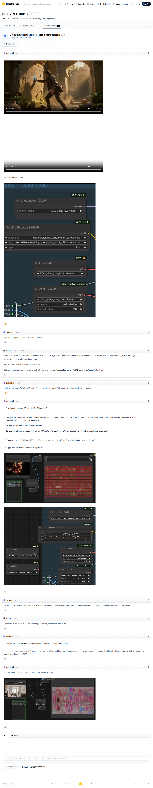

# Visited: https://huggingface.co/Kijai/LTXV2_comfy/discussions/28
**Time:** Thu May 14 13:13:26 UTC 2026

## Screenshot

## Raw mhtml
[page.mhtml](./page.mhtml)

## Downloaded Media (8 files)
## Downloaded Media Files

- [F51Hbi3IYFp0r9a2F5OfD.mp4](./media/F51Hbi3IYFp0r9a2F5OfD.mp4) (738 KB)

- [xBBWiwCjiNb9imqMQiF0-.mp4](./media/xBBWiwCjiNb9imqMQiF0-.mp4) (364 KB)

## Other Links
- [#69675e4d93c2b2305ac63c98](#69675e4d93c2b2305ac63c98)
- [#696761640e4f8aeac2cc8e22](#696761640e4f8aeac2cc8e22)
- [#6967667f8ac247c2ea84dfde](#6967667f8ac247c2ea84dfde)
- [#69685506644493287af3f6ac](#69685506644493287af3f6ac)
- [#6968980a102d17a3afeb8c3d](#6968980a102d17a3afeb8c3d)
- [#696926b6efdaa96d627b7b7c](#696926b6efdaa96d627b7b7c)
- [#6969298896d9142e971e0249](#6969298896d9142e971e0249)
- [#696942f98e21bedfd6000923](#696942f98e21bedfd6000923)
- [#6969975e070b604bbe1ab0ba](#6969975e070b604bbe1ab0ba)
- [/](/)
- [/Kijai](/Kijai)
- [/Kijai/LTXV2_comfy](/Kijai/LTXV2_comfy)
- [/Kijai/LTXV2_comfy/discussions](/Kijai/LTXV2_comfy/discussions)
- [/Kijai/LTXV2_comfy/discussions/28](/Kijai/LTXV2_comfy/discussions/28)
- [/Kijai/LTXV2_comfy/tree/main](/Kijai/LTXV2_comfy/tree/main)
- [/RuneXX](/RuneXX)
- [/Vicullum](/Vicullum)
- [/agus2312](/agus2312)
- [/datasets](/datasets)
- [/docs](/docs)
- [/enterprise](/enterprise)
- [/front/build/kube-1daa235/style.css](/front/build/kube-1daa235/style.css)
- [/huggingface](/huggingface)
- [/join](/join)
- [/join?next=%2FKijai%2FLTXV2_comfy%2Fdiscussions%2F28](/join?next=%2FKijai%2FLTXV2_comfy%2Fdiscussions%2F28)
- [/js/script.js](/js/script.js)
- [/kukalikuk](/kukalikuk)
- [/login](/login)
- [/login?next=%2FKijai%2FLTXV2_comfy%2Fdiscussions%2F28](/login?next=%2FKijai%2FLTXV2_comfy%2Fdiscussions%2F28)
- [/models](/models)
- [/models?library=gguf](/models?library=gguf)
- [/models?other=comfyui](/models?other=comfyui)
- [/noone-ai](/noone-ai)
- [/pricing](/pricing)
- [/privacy](/privacy)
- [/spaces](/spaces)
- [/storage](/storage)
- [/terms-of-service](/terms-of-service)
- [https://apply.workable.com/huggingface/](https://apply.workable.com/huggingface/)
- [https://cdnjs.cloudflare.com/ajax/libs/KaTeX/0.12.0/katex.min.css](https://cdnjs.cloudflare.com/ajax/libs/KaTeX/0.12.0/katex.min.css)
- [https://de5282c3ca0c.edge.sdk.awswaf.com/de5282c3ca0c/526cf06acb0d/challenge.js](https://de5282c3ca0c.edge.sdk.awswaf.com/de5282c3ca0c/526cf06acb0d/challenge.js)
- [https://fonts.googleapis.com/css2?family=IBM+Plex+Mono:wght@400;600;700&display=swap](https://fonts.googleapis.com/css2?family=IBM+Plex+Mono:wght@400;600;700&display=swap)
- [https://fonts.googleapis.com/css2?family=Source+Sans+Pro:ital,wght@0,200;0,300;0,400;0,600;0,700;1,200;1,300;1,400;1,600;1,700&display=swap](https://fonts.googleapis.com/css2?family=Source+Sans+Pro:ital,wght@0,200;0,300;0,400;0,600;0,700;1,200;1,300;1,400;1,600;1,700&display=swap)
- [https://fonts.gstatic.com](https://fonts.gstatic.com)
- [https://huggingface.co/Kijai/LTXV2_comfy/discussions/28](https://huggingface.co/Kijai/LTXV2_comfy/discussions/28)
- [https://huggingface.co/Kijai/LTXV2_comfy/tree/main](https://huggingface.co/Kijai/LTXV2_comfy/tree/main)

## Stats
- Links: 59
- Media: 8
