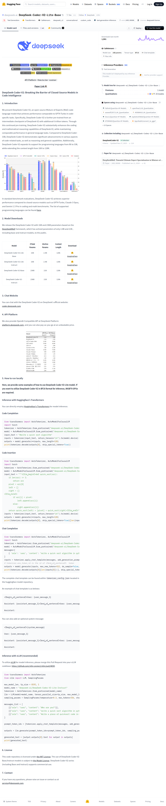

# Visited: https://huggingface.co/deepseek-ai/DeepSeek-Coder-V2-Lite-Base
**Time:** Mon May 11 14:45:06 UTC 2026

## Screenshot

## Raw mhtml
[page.mhtml](./page.mhtml)

## Downloaded Media (2 files)
## Downloaded Media Files

- [paper.pdf](./media/paper.pdf) (224 KB)

## Other Links
- [#1-introduction](#1-introduction)
- [#2-model-downloads](#2-model-downloads)
- [#3-chat-website](#3-chat-website)
- [#4-api-platform](#4-api-platform)
- [#5-how-to-run-locally](#5-how-to-run-locally)
- [#6-license](#6-license)
- [#7-contact](#7-contact)
- [#chat-completion](#chat-completion)
- [#code-completion](#code-completion)
- [#code-insertion](#code-insertion)
- [#deepseek-coder-v2-breaking-the-barrier-of-closed-source-models-in-code-intelligence](#deepseek-coder-v2-breaking-the-barrier-of-closed-source-models-in-code-intelligence)
- [#inference-with-huggingfaces-transformers](#inference-with-huggingfaces-transformers)
- [#inference-with-vllm-recommended](#inference-with-vllm-recommended)
- [/](/)
- [/collections/deepseek-ai/deepseekcoder-v2](/collections/deepseek-ai/deepseekcoder-v2)
- [/datasets](/datasets)
- [/deepseek-ai](/deepseek-ai)
- [/deepseek-ai/DeepSeek-Coder-V2-Lite-Base](/deepseek-ai/DeepSeek-Coder-V2-Lite-Base)
- [/deepseek-ai/DeepSeek-Coder-V2-Lite-Base/blob/main/service@deepseek.com](/deepseek-ai/DeepSeek-Coder-V2-Lite-Base/blob/main/service@deepseek.com)
- [/deepseek-ai/DeepSeek-Coder-V2-Lite-Base/colab](/deepseek-ai/DeepSeek-Coder-V2-Lite-Base/colab)
- [/deepseek-ai/DeepSeek-Coder-V2-Lite-Base/discussions](/deepseek-ai/DeepSeek-Coder-V2-Lite-Base/discussions)
- [/deepseek-ai/DeepSeek-Coder-V2-Lite-Base/kaggle](/deepseek-ai/DeepSeek-Coder-V2-Lite-Base/kaggle)
- [/deepseek-ai/DeepSeek-Coder-V2-Lite-Base/tree/main](/deepseek-ai/DeepSeek-Coder-V2-Lite-Base/tree/main)
- [/deepseek-ai/DeepSeek-Coder-V2-Lite-Base?library=transformers](/deepseek-ai/DeepSeek-Coder-V2-Lite-Base?library=transformers)
- [/deepseek-ai/DeepSeek-Coder-V2-Lite-Base?local-app=docker-model-runner](/deepseek-ai/DeepSeek-Coder-V2-Lite-Base?local-app=docker-model-runner)
- [/deepseek-ai/DeepSeek-Coder-V2-Lite-Base?local-app=sglang](/deepseek-ai/DeepSeek-Coder-V2-Lite-Base?local-app=sglang)
- [/deepseek-ai/DeepSeek-Coder-V2-Lite-Base?local-app=vllm](/deepseek-ai/DeepSeek-Coder-V2-Lite-Base?local-app=vllm)
- [/docs](/docs)
- [/docs/hub/model-cards#specifying-a-base-model](/docs/hub/model-cards#specifying-a-base-model)
- [/enterprise](/enterprise)
- [/front/build/kube-0f8a04c/style.css](/front/build/kube-0f8a04c/style.css)
- [/huggingface](/huggingface)
- [/join](/join)
- [/js/script.js](/js/script.js)
- [/login](/login)
- [/models](/models)
- [/models?apps=jan&amp;other=base_model:quantized:deepseek-ai/DeepSeek-Coder-V2-Lite-Base](/models?apps=jan&amp;other=base_model:quantized:deepseek-ai/DeepSeek-Coder-V2-Lite-Base)
- [/models?apps=llama.cpp&amp;other=base_model:quantized:deepseek-ai/DeepSeek-Coder-V2-Lite-Base](/models?apps=llama.cpp&amp;other=base_model:quantized:deepseek-ai/DeepSeek-Coder-V2-Lite-Base)
- [/models?apps=lmstudio&amp;other=base_model:quantized:deepseek-ai/DeepSeek-Coder-V2-Lite-Base](/models?apps=lmstudio&amp;other=base_model:quantized:deepseek-ai/DeepSeek-Coder-V2-Lite-Base)
- [/models?apps=ollama&amp;other=base_model:quantized:deepseek-ai/DeepSeek-Coder-V2-Lite-Base](/models?apps=ollama&amp;other=base_model:quantized:deepseek-ai/DeepSeek-Coder-V2-Lite-Base)
- [/models?library=safetensors](/models?library=safetensors)
- [/models?library=transformers](/models?library=transformers)
- [/models?other=base_model:finetune:deepseek-ai/DeepSeek-Coder-V2-Lite-Base](/models?other=base_model:finetune:deepseek-ai/DeepSeek-Coder-V2-Lite-Base)
- [/models?other=base_model:quantized:deepseek-ai/DeepSeek-Coder-V2-Lite-Base](/models?other=base_model:quantized:deepseek-ai/DeepSeek-Coder-V2-Lite-Base)
- [/models?other=conversational](/models?other=conversational)
- [/models?other=custom_code](/models?other=custom_code)
- [/models?other=deepseek_v2](/models?other=deepseek_v2)
- [/models?other=text-generation-inference](/models?other=text-generation-inference)
- [/models?pipeline_tag=text-generation](/models?pipeline_tag=text-generation)
- [/papers/2401.06066](/papers/2401.06066)

## Stats
- Links: 109
- Media: 2
